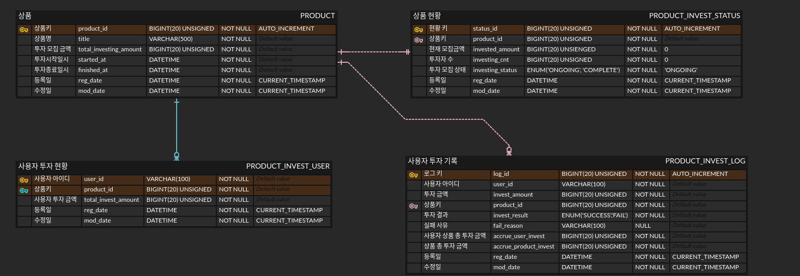

# 카카오페이 서버개발 과제

---

## 개발 환경

- Ubuntu 20.04
- H2 1.4.200
- RabbitMQ 3.9.7
- Redis 5.0.7


- OpenJDK11
- Spring Boot 2.5.3
- JPA
- QueryDSL
- EHCache
- Gradle
- Junit5

---

## 서버 구성

### 멀티모듈 구성도


### 서버 구성도


### ERD

[DDL](./core/src/main/resources/schema.sql)

---

## 핵심문제 해결 전략


--- 
---

## API 분석

### 1. 전체 투자 상품 조회 API

Request
```bash
curl -X GET "http://localhost:8080/api/product?page=0&size=10"
```

Response body
```json
{
  "result": true,
  "code": "01",
  "message": null,
  "data": {
    "totalCount": 2,
    "list": [
      {
        "productId": 3,
        "title": "product2",
        "totalInvestingAmount": 100,
        "currentInvestingAmount": 100,
        "investingCnt": 4,
        "startedAt": "2021-09-27T03:08:23.115211",
        "finishedAt": "2021-10-17T00:00:00",
        "investStatus": "COMPLETE"
      },
      {
        "productId": 2,
        "title": "product1",
        "totalInvestingAmount": 1000,
        "currentInvestingAmount": 210,
        "investingCnt": 3,
        "startedAt": "2021-09-26T03:02:16.953372",
        "finishedAt": "2021-10-17T00:00:00",
        "investStatus": "ONGOING"
      }
    ]
  },
  "status": 200
}
```


1. 상품 데이터 요청  
   - (1) EHCache에 Product 데이터 캐시를 확인  
    
   - (2-1) Cache hit시 해당 Product 데이터를 사용  
   - (2-2) Cache miss시 데이터베이스에 요청  
   - (2-2-1) 데이터베이스에 쿼리를 통해 Product 데이터를 사용

2. 현재 모집금액, 투자자 수 요청  
   - (3) 변동이 빈번한 currentInvestingAmount, investingCnt 의 경우 Redis를 통하여 요청
   

### 2. 투자하기 API

Request
```bash
curl -X POST "http://localhost:8081/api/invest" -H "X-USER-ID: user4" -H "Content-Type: application/json" -d "{ \"investAmount\": 10, \"productId\": 3}"
```

Response body
```json
// 성공시
{
  "result": true,
  "code": "01",
  "message": null,
  "data": "OK",
  "status": 200
}

// 총 투자모집 금액 넘을시 Sold out 반환
{
  "result": false,
  "code": "SOLD_OUT",
  "message": "Product is sold out : ",
  "data": null,
  "status": 200
}


// X-USER-ID 없을 경우
{
  "result": false,
  "code": "MISSING_X_USER_ID",
  "message": "Missing X-USER-ID header value : ",
  "data": null,
  "status": 400
}
```


1. Validation
   - (1) 동기화를 위해 Distributed lock 요청
   - (2) 상품의 현재 총 투자금액을 요청
   - (3) 총 투자금액이 상품의 목표 투자금액을 넘을시 Sold out 반환
   
2. 1차 투자 처리후 성공처리 반환 
   - (4) 상품의 현재 총 투자금액에 현재 투자요청 금액을 추가
   - (5) PRODUCT_INVEST_LOG 테이블에 해당 요청건을 등록  
   이때 invest_result = FAIL, fail_reason = PENDING 처리한다
   - (6) RabbitMQ에 productId와 investLogId를 메세지로 보낸다
   - (7) RabbitMQ에 비동기 처리 후 클라이언트에 성공처리 반환  
   
3. 투자 완료처리 
   - (8) RabbitMQ의 Queue에 등록된 메세지를 순차적으로 Mq_receive 서버가 Consume 한다
   - (9) PRODUCT_INVEST_STATUS 에 메세지로 전달받은 productId를 기준으로 투자를 최신 상태로 업데이트한다
   - PRODUCT_INVEST_USER 테이블에 사용자의 해당 Product에 대한 누적 투자 기록을 업데이트한다
   - (10) 메세지로 전달받은 investLogId의 로그건을  
   invest_result = SUCCESS, fail_reason = null 로 업데이트하여 투자를 성공적으로 마친다

 
### 3. 나의 투자상품 조회 API

Request
```bash
curl -X GET "http://localhost:8080/api/product/my/invest?page=0&size=10" -H "X-USER-ID: user4"
```

Response body
```json
// 성공시 
{
  "result": true,
  "code": "01",
  "message": null,
  "data": {
    "totalCount": 2,
    "list": [
      {
        "productId": 2,
        "userId": "user4",
        "title": "product1",
        "totalInvestingAmount": 1000,
        "myInvestingAmount": 10,
        "investDate": "2021-09-27T03:55:51.294487"
      },
      {
        "productId": 3,
        "userId": "user4",
        "title": "product2",
        "totalInvestingAmount": 100,
        "myInvestingAmount": 30,
        "investDate": "2021-09-27T03:11:01.981852"
      }
    ]
  },
  "status": 200
}

// X-USER-ID 없을 경우
{
  "result": false,
  "code": "MISSING_X_USER_ID",
  "message": "Missing X-USER-ID header value : ",
  "data": null,
  "status": 400
}
```


1. 사용자의 투자상품을 반환
   - (1) QueryDSL의 QueryProjection 을 통해 사용자의 투자상품 현황을 반환 받는다  
